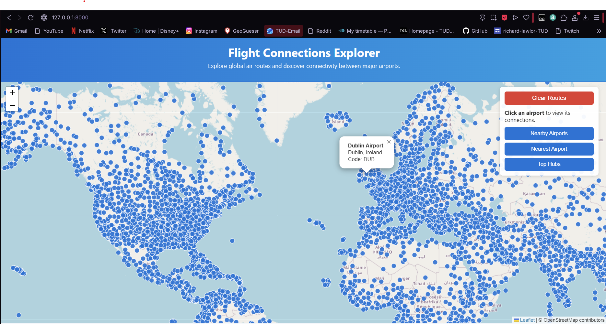
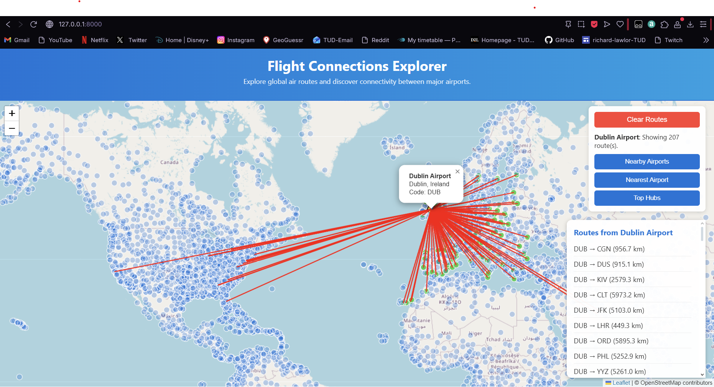

## Overview
**Flight Connections Explorer** is a web mapping application inspired by *flightconnections.com*.
It visualises real airports and routes using Django + GeoDjango with a PostGIS backend and an interactive Leaflet.js frontend.

Users can click on airports to see connections, or click anywhere on the map to find nearby or nearest airports using real spatial queries.

---

## Tech Stack
- **Backend:** Django 4.2 + GeoDjango
- **Database:** PostgreSQL + PostGIS
- **Frontend:** Leaflet.js + Vanilla JS
- **API:** Django REST Framework (GeoJSON)
- **GIS Libraries:** GDAL, GEOS, PROJ
- **Python:** 3.13 (Windows)

---

## Key Features
- View all airports and routes on an interactive map.
- Click an airport to see its routes (red lines).
- Click anywhere on the map to:
  - Show nearby airports within chosen radius (purple markers + circle).
  - Show nearest airport to that point.
- View top hub countries by airport count.
- Clear and reset map.

### Main Map View


### Route Visualization


---

## Spatial Queries Implemented
| # | Query | Endpoint | Function |
|---|--------|-----------|-----------|
| 1 | Nearby Airports | `/api/airports/nearby/?lat=&lon=&radius=` | `ST_DWithin` |
| 2 | Nearest Airport | `/api/airports/nearest/?lat=&lon=` | `ST_Distance` |
| 3 | Routes by Airport | `/api/airports/routes/?origin=` | Spatial relation (Point→LineString) |

## Setup
```bash
python -m venv webmapping_env
webmapping_env\Scripts\activate
pip install -r requirements.txt
python manage.py migrate
python manage.py load_airports "airports.dat"
python manage.py load_routes "routes.dat"
python manage.py runserver
```
Then visit: [http://127.0.0.1:8000/](http://127.0.0.1:8000/)

---

## 🌐 API Overview

The application exposes a RESTful GeoJSON API built with Django REST Framework and GeoDjango.

| Endpoint | Method | Description |
|-----------|---------|-------------|
| `/api/airports/` | GET | List all airports (GeoJSON FeatureCollection) |
| `/api/airports/routes/?origin=DUB` | GET | Routes originating from DUB |
| `/api/airports/nearby/?lat=53.35&lon=-6.26&radius=100` | GET | All airports within 100 km of a coordinate |
| `/api/airports/nearest/?lat=53.35&lon=-6.26` | GET | Single nearest airport |
| `/api/airports/hubs/?top=10` | GET | Top countries with the most airports |
| `/api/routes/` | GET | List all available flight routes |


## Usage
- **Click airport** → Show its routes.  
- **Click map** → Set location for proximity queries.  
- **Nearby Airports** → Enter radius (km).  
- **Nearest Airport** → Highlights closest airport.  
- **Top Hubs** → Shows top countries.  
- **Clear Routes** → Resets all layers.
